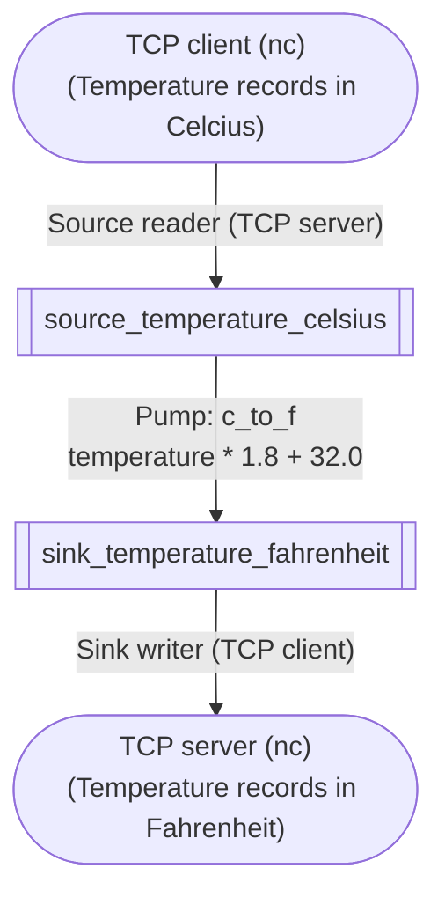

import Tabs from '@theme/Tabs';
import TabItem from '@theme/TabItem';

# Write Basic Apps

You might already succeeded in [running a demo app](./install-and-run-app).
Now let's start writing some basic apps step-by-step.

You will learn important ideas in stream processing from the following apps, including **event time**, **window**-based **aggregation** and **join**.

## App1: Simple arithmetic conversion over a stream

Let's start with a very simple pipeline (dataflow in SpringQL), which is quite similar to the demo app you saw in previous page.



The above diagram represents the pipeline you will define in the code.

- The top-most node is a foreign **source**. A foreign source continuously inputs data into a stream processing application.
- The bottom-most represents a foreign **sink**. A foreign sink continuously gets output from the stream processing application.
- The top square is a source **stream** and the bottom square is a sink stream. A stream is like a table in relational databases, which has a stream name, columns and their data types, and constraints (`NOT NULL`, for example).
- Edges from the foreign source is a source reader, who reads data from a foreign source and translates them into rows for the next source stream.
  Similarly, edges into the foreign sink is a sink writer, who fetches the rows in the sink stream and writes them into a foreign sink.
- The edge between the source stream and the sink stream is a **pump**. A pump reads rows from an upstream _stream_ (just called _upstream_), processes the rows into other ones, and writes new rows into a downstream _stream_ (just called _downstream_).

You learned the very basic components to construct SpringQL's pipline. Now is the time to code.
Choose your favorite language from the tabs:

<Tabs>
<TabItem value="rust" label="Rust">

```toml title="Cargo.toml"
# ...
[dependencies]
springql-core = "*"
```

```rust title="main.rs"
use springql_core::{high_level_rs::SpringPipelineHL, low_level_rs::SpringConfig};

fn main() {
    const SOURCE_PORT: u16 = 54300;

    let pipeline = SpringPipelineHL::new(&SpringConfig::default()).unwrap();

    pipeline
        .command(
            "
            CREATE SOURCE STREAM source_temperature_celsius (
                ts TIMESTAMP NOT NULL ROWTIME,    
                temperature FLOAT NOT NULL
            );
            ",
        )
        .unwrap();

    pipeline
        .command(
            "
            CREATE SINK STREAM sink_temperature_fahrenheit (
                ts TIMESTAMP NOT NULL ROWTIME,    
                temperature FLOAT NOT NULL
            );
            ",
        )
        .unwrap();

    pipeline
        .command(
            "
            CREATE PUMP c_to_f AS
                INSERT INTO sink_temperature_fahrenheit (ts, temperature)
                SELECT STREAM
                    source_temperature_celsius.ts,
                    32.0 + source_temperature_celsius.temperature * 1.8
                FROM source_temperature_celsius;
            ",
        )
        .unwrap();

    pipeline
        .command(
            "
            CREATE SINK WRITER queue_temperature_fahrenheit FOR sink_temperature_fahrenheit
            TYPE IN_MEMORY_QUEUE OPTIONS (
                NAME 'q'
            );
            ",
        )
        .unwrap();

    pipeline
        .command(format!(
            "
            CREATE SOURCE READER tcp_trade FOR source_temperature_celsius
            TYPE NET_SERVER OPTIONS (
                PROTOCOL 'TCP',
                PORT '{}'
            );
            ",
            SOURCE_PORT
        ))
        .unwrap();

    eprintln!("waiting JSON records in tcp/{} port...", SOURCE_PORT);

    while let Ok(row) = pipeline.pop("q") {
        let ts: String = row.get_not_null_by_index(0).unwrap();
        let temperature_fahrenheit: f32 = row.get_not_null_by_index(1).unwrap();
        eprintln!("{}\t{}", ts, temperature_fahrenheit);
    }
}
```

_Also available in [GitHub](https://github.com/SpringQL/SpringQL/blob/main/springql-core/examples/doc_app1.rs)._

```bash title="Run the app (start app)"
cargo run
```

</TabItem>

<TabItem value="c" label="C">

```c title="main.c"
// Usage:
//
// $ ./a.out  # waiting for connection...
// $ echo '{"ts": "2022-01-01 13:00:00.000000000", "temperature": 5.3}' |nc localhost 54300

#include <assert.h>
#include <string.h>
#include <stdio.h>

#include <springql.h>

void abort_with_report()
{
    SpringErrno errno;
    char errmsg[1024];
    spring_last_err(&errno, errmsg, 1024);
    fprintf(stderr, "Error occurred (%d): %s", errno, errmsg);
    abort();
}

void assert_ok(SpringErrno ret)
{
    if (ret != Ok)
    {
        abort_with_report();
    }
}

void assert_not_null(void *p)
{
    if (p == NULL)
    {
        abort_with_report();
    }
}

int main()
{
    SpringErrno ret;

    SpringConfig *config = spring_config_default();
    assert_not_null(config);

    SpringPipeline *pipeline = spring_open(config);
    assert_not_null(pipeline);

    ret = spring_command(
        pipeline,
        "CREATE SOURCE STREAM source_temperature_celsius ("
        "    ts TIMESTAMP NOT NULL ROWTIME,"
        "    temperature FLOAT NOT NULL"
        ");");
    assert_ok(ret);

    ret = spring_command(
        pipeline,
        "CREATE SINK STREAM sink_temperature_fahrenheit ("
        "    ts TIMESTAMP NOT NULL ROWTIME,"
        "    temperature FLOAT NOT NULL"
        ");");
    assert_ok(ret);

    ret = spring_command(
        pipeline,
        "CREATE PUMP c_to_f AS"
        "    INSERT INTO sink_temperature_fahrenheit (ts, temperature)"
        "    SELECT STREAM"
        "       source_temperature_celsius.ts,"
        "       32.0 + source_temperature_celsius.temperature * 1.8"
        "    FROM source_temperature_celsius;");
    assert_ok(ret);

    ret = spring_command(
        pipeline,
        "CREATE SINK WRITER queue_temperature_fahrenheit FOR sink_temperature_fahrenheit"
        "    TYPE IN_MEMORY_QUEUE OPTIONS ("
        "        NAME 'q'"
        "    );");
    assert_ok(ret);

    ret = spring_command(
        pipeline,
        "CREATE SOURCE READER tcp_trade FOR source_temperature_celsius"
        "    TYPE NET_SERVER OPTIONS ("
        "        PROTOCOL 'TCP',"
        "        PORT '54300'"
        "    );");
    assert_ok(ret);

    fprintf(stderr, "waiting JSON records in tcp/54300...\n");

    SpringRow *row;
    while (1)
    {
        row = spring_pop(pipeline, "q");
        assert_not_null(row);

#define TS_LEN 128
        const char ts[TS_LEN];

        int r = spring_column_text(row, 0, (char *)ts, TS_LEN);
        assert((size_t)r == strlen(ts));

        float temperature_fahrenheit;
        ret = spring_column_float(row, 1, &temperature_fahrenheit);
        assert_ok(ret);

        fprintf(stderr, "%s\t%f\n", ts, temperature_fahrenheit);
        spring_row_close(row);
    }

    ret = spring_close(pipeline);
    assert_ok(ret);

    ret = spring_config_close(config);
    assert_ok(ret);

    return 0;
}
```

_Also available in [GitHub](https://github.com/SpringQL/SpringQL-client-c/blob/main/c_example/doc_app1/doc_app1.c)._

To build the app, you need to place `springql.h` into an `$INCLUDE_PATH` and `libspringql_client.{so,dylib}` into `LD_LIBRARY_PATH`.

```bash title="Build the app"
gcc main.c -lspringql_client
```

```bash title="Run the app (start app)"
./a.out
```

</TabItem>
</Tabs>

```bash title="Run the app (input from foreign source)"
echo '{"ts": "2022-01-01 13:00:00.000000000", "temperature": 5.3}' | nc localhost 54300
```

Then, you'll get the following outputs:

```text title="Output"
2022-01-01 13:00:00.000000000   41.54
```

## App2: Window aggregation

Stream data are unbounded in nature. Some kind of operations such as simple arithmetic conversion and filtering are naturally applied to each of streaming row.

But other types of operations, such as sort, aggregation, and join, are applied to a set of rows.
How can you make a set of rows from unbounded sequence of rows?
You can use **windows** to split unbounded rows into bounded amount of rows.


In the figure above, you see a stream data includes (conceptually) unbouded number of records.
Also, you see there are three windows, each having 2, 1, and 1 records.
Inside a window, the number of records is bounded. So you can apply set operations like sort, aggregation, and join within the window.
