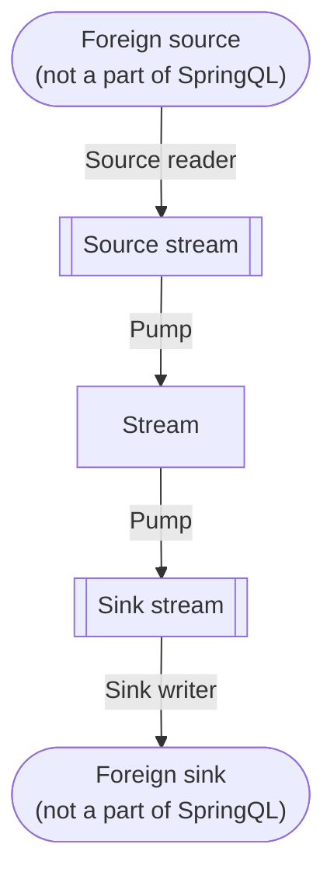

# Pipeline

A pipeline is a dataflow definition in SpringQL.

A pipeline is represented as a DAG (Directed Acyclic Graph), whose nodes are either of foreign source, foreign sink, or **stream**,
and edges are either of **source reader**, **sink writer**, or **pump**.

In this section, you will learn what conceptually they are and detailed variations of them.
