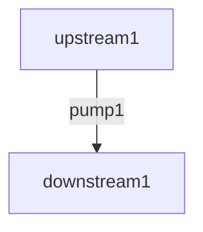

# Pump

Pumps define stream-to-stream dataflow. A pump fetches rows from upstream streams (often called _upstreams_), process them, and pushes them to a downstream.

Let's look at an example pump:

```sql title="Pump definition"
CREATE PUMP pump1 AS
  INSERT INTO downstream1 (col1, col2)
  SELECT STREAM
    ...,
    ...
  FROM upstream1
  ...;
```

Note that this statements includes `SELECT` sub-statement to fetch and process rows from upstreams, and `INSERT` sub-statement to push result rows to downstreams.

This statement defines the following pump (the edge in the diagram).



Some pumps, such as with join operations, have 2 or more upstreams, while the number of donwstream must be always 1.

Pumps with `WINDOW` clause create [window](../window) and others do not.
