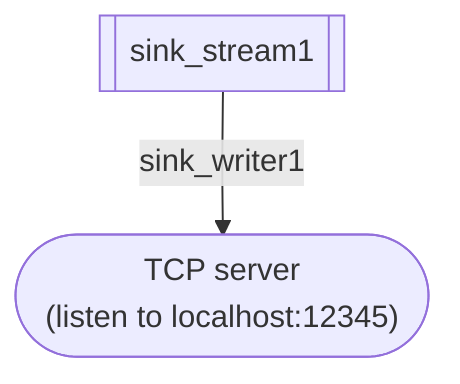

# Sink writer

Except for the IN_MEMORY_QUEUE sink writer, a sink writer conducts the 

1. keeping "connection" (network connection, file handle) to a foreign sink.
2. fetching rows from a sink stream.
3. converting the rows into arbitrary data that the foreign sink can accept.
4. writing the data to the foreign sink.

Let's look at an example sink writer:

```sql title="Sink writer definition"
CREATE SOURCE READER sink_writer1
  FOR sink_stream1
  TYPE NET_CLIENT OPTIONS (
    PROTOCOL 'TCP',
    REMOTE_HOST 'localhost',
    REMOTE_PORT '12345'
  );
```

This statement defines the following source reader (the edge in the diagram).



The `sink_writer1` does the following:

1. Connect to the TCP port `12345` on the localhost.
2. Fetch a row from the `sink_stream1`.
3. Convert the into a JSON object line like: `{"ts": "2020-01-01 00:00:00.000000000", "c1": 1}`
4. Write the JSON object line to the connection, and repeat from 2.

## Sink writer types and options

A sink writer has a name, a type, and options.
A type of a sink writer determines the available options.

Here lists the currently available sink writers.

### IN_MEMORY_QUEUE

Writes data into an in-memory queue allocated in the application's memory space linked to SpringQL.
The application pops rows from the queue using `*pop()` API.

See: [Client API](../../reference/client-api).

- _Options_
  - (required) `NAME`: queue's name.

### NET_CLIENT

Connects to a foreign sink via TCP.

- _Options_
  - `PROTOCOL`: must be `TCP`.
  - `REMOTE_HOST`: host name or IP address of the remote host.
  - `REMOTE_PORT`: port number of the remote host.

## Sink data format

Currently, only 1-line JSON objects are supported as an output datum from a source writer.
Foreign sinks must accept such data format.

Say, you have the following sink stream:

```sql title="Sink stream"
CREATE SINK STREAM ss (
    ts TIMESTAMP NOT NULL ROWTIME,    
    c1 INTEGER NOT NULL
);
```

A sink writer can output the following JSON.

```json title="JSON output example"
{ "ts": "2020-01-01 00:00:00.000000000", "c1": 1 }
```
