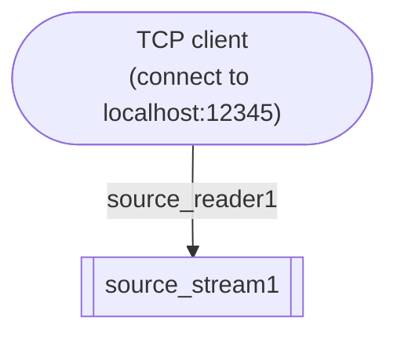

# Source reader

A source reader conducts the following 3 roles:

1. keeping "connection" (network connection, file handle) to a foreign source.
2. converting arbitrary data from the foreign source into SpringQL's rows.
3. pushing the rows into a source stream.

Let's look at an example source reader:

```sql title="Source reader definition"
CREATE SOURCE READER source_reader1
  FOR source_stream1
  TYPE NET_SERVER OPTIONS (
    PROTOCOL 'TCP',
    PORT '12345'
  );
```

This statement defines the following source reader (the edge in the diagram).



The `source_reader1` does the following:

1. Listen to the TCP port `12345` on the localhost.
2. Accept an connection from a client.
3. Read a JSON object line like: `{"ts": "2020-01-01 00:00:00.000000000", "c1": 1}`
4. Convert the JSON object into a SpringQL row.
5. Push the row into the `source_stream1`, and repeat from 3.

## Source reader types and options

A source reader has a name, a type, and options.
A type of a source reader determines the available options.

The table below shows the currently available source readers.

### NET_CLIENT

Connects to a foreign source via TCP.

- _Options_
  - `PROTOCOL`: must be `TCP`.
  - `REMOTE_HOST`: host name or IP address of the remote host.
  - `REMOTE_PORT`: port number of the remote host.

### NET_SERVER

Accepts to a foreign source's connection via TCP.

- _Options_
  - `PROTOCOL`: must be `TCP`.
  - `PORT`: port number to listen.

## Source data format

Currently, only 1-line JSON objects are supported as an input datum from a foreign source.

```json title="JSON object convertible to a SpringQL's row"
{ "column_name1": <value convertible to source stream's data type>, "column_name2": <value2>, ... }
```

Say, you have the following source stream:

```sql title="Stream definition in SQL"
CREATE STREAM s (
    ts TIMESTAMP NOT NULL ROWTIME,    
    c1 INTEGER NOT NULL
);
```

Then a valid JSON objects for an input into source readers are:

```json title="Valid JSONs"
{ "ts": "2020-01-01 00:00:00.000000000", "c1": 1 }
{ "c1": 42, "ts": "1970-01-01 00:00:00.000000000" }
```

The following ones are invalid:

```json title="Invalid JSONs"
# column name
{ "timestamp": "2020-01-01 00:00:00.000000000", "c1": 1 }

# timestamp format must currently have 9-digit fractional parts
{ "ts": "2020-01-01 00:00:00", "c1": 1 }

# string cannot be converted into INTEGER type 
{ "ts": "2020-01-01 00:00:00.000000000", "c1": "1" }
```
