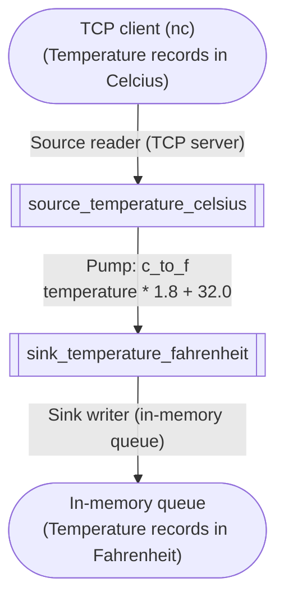
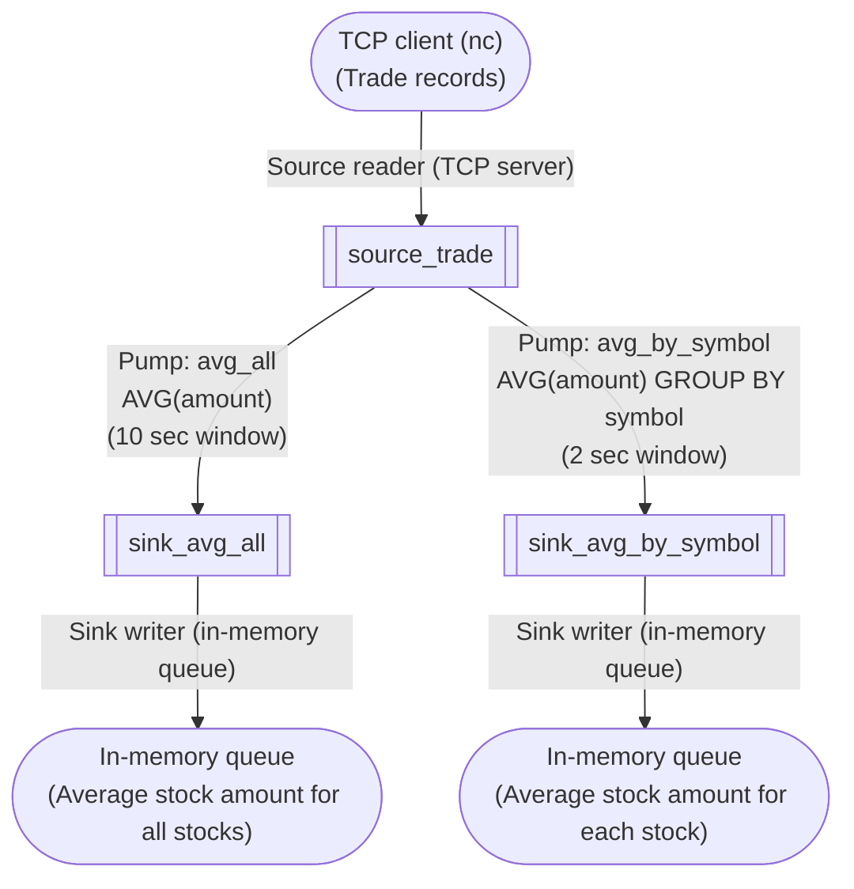

import Tabs from '@theme/Tabs';
import TabItem from '@theme/TabItem';

# Write Basic Apps

You might already succeeded in [running a demo app](./install-and-run-app).
Now let's start writing some basic apps step-by-step.

You will learn important ideas in stream processing from the following apps, including **event time**, **window**-based **aggregation** and **join**.

## App1: Simple arithmetic conversion over a stream

Let's start with a very simple pipeline (dataflow in SpringQL), which is quite similar to the demo app you saw in previous page.



The above diagram represents the pipeline you will define in the code.

- The top-most node is a foreign **source**. A foreign source continuously inputs data into a stream processing application.
- The bottom-most represents a foreign **sink**. A foreign sink continuously gets output from the stream processing application.
- The top square is a source **stream** and the bottom square is a sink stream. A stream is like a table in relational databases, which has a stream name, columns and their data types, and constraints (`NOT NULL`, for example).
- Edges from the foreign source is a source reader, who reads data from a foreign source and translates them into rows for the next source stream.
  Similarly, edges into the foreign sink is a sink writer, who fetches the rows in the sink stream and writes them into a foreign sink.
- The edge between the source stream and the sink stream is a **pump**. A pump reads rows from an upstream _stream_ (just called _upstream_), processes the rows into other ones, and writes new rows into a downstream _stream_ (just called _downstream_).

You learned the very basic components to construct SpringQL's pipline. Now is the time to code.
Choose your favorite language from the tabs:

<Tabs>
<TabItem value="rust" label="Rust">

```toml title="Cargo.toml"
# ...
[dependencies]
springql-core = "*"
```

```rust title="main.rs"
use springql_core::api::{SpringPipeline, SpringConfig};

fn main() {
    const SOURCE_PORT: u16 = 54300;

    let pipeline = SpringPipeline::new(&SpringConfig::default()).unwrap();

    pipeline
        .command(
            "
            CREATE SOURCE STREAM source_temperature_celsius (
                ts TIMESTAMP NOT NULL ROWTIME,    
                temperature FLOAT NOT NULL
            );
            ",
        )
        .unwrap();

    pipeline
        .command(
            "
            CREATE SINK STREAM sink_temperature_fahrenheit (
                ts TIMESTAMP NOT NULL ROWTIME,    
                temperature FLOAT NOT NULL
            );
            ",
        )
        .unwrap();

    pipeline
        .command(
            "
            CREATE PUMP c_to_f AS
                INSERT INTO sink_temperature_fahrenheit (ts, temperature)
                SELECT STREAM
                    source_temperature_celsius.ts,
                    32.0 + source_temperature_celsius.temperature * 1.8
                FROM source_temperature_celsius;
            ",
        )
        .unwrap();

    pipeline
        .command(
            "
            CREATE SINK WRITER queue_temperature_fahrenheit FOR sink_temperature_fahrenheit
            TYPE IN_MEMORY_QUEUE OPTIONS (
                NAME 'q'
            );
            ",
        )
        .unwrap();

    pipeline
        .command(format!(
            "
            CREATE SOURCE READER tcp_temperature_celsius FOR source_temperature_celsius
            TYPE NET_SERVER OPTIONS (
                PROTOCOL 'TCP',
                PORT '{}'
            );
            ",
            SOURCE_PORT
        ))
        .unwrap();

    eprintln!("waiting JSON records in tcp/{} port...", SOURCE_PORT);

    while let Ok(row) = pipeline.pop("q") {
        let ts: String = row.get_not_null_by_index(0).unwrap();
        let temperature_fahrenheit: f32 = row.get_not_null_by_index(1).unwrap();
        eprintln!("{}\t{}", ts, temperature_fahrenheit);
    }
}
```

_Also available in [GitHub](https://github.com/SpringQL/SpringQL/blob/main/springql-core/examples/doc_app1.rs)._

```bash title="Run the app (start app)"
cargo run
```

</TabItem>

<TabItem value="c" label="C">

```c title="main.c"
// Usage:
//
// $ ./a.out  # waiting for connection...
// $ echo '{"ts": "2022-01-01 13:00:00.000000000", "temperature": 5.3}' |nc localhost 54300

#include <assert.h>
#include <string.h>
#include <stdio.h>

#include <springql.h>

void abort_with_report()
{
    SpringErrno errno_;
    char errmsg[1024];
    spring_last_err(&errno_, errmsg, 1024);
    fprintf(stderr, "Error occurred (%d): %s", errno_, errmsg);
    abort();
}

void assert_ok(SpringErrno ret)
{
    if (ret != Ok)
    {
        abort_with_report();
    }
}

void assert_not_null(void *p)
{
    if (p == NULL)
    {
        abort_with_report();
    }
}

int main()
{
    SpringErrno ret;

    SpringConfig *config = spring_config_default();
    assert_not_null(config);

    SpringPipeline *pipeline = spring_open(config);
    assert_not_null(pipeline);

    ret = spring_command(
        pipeline,
        "CREATE SOURCE STREAM source_temperature_celsius ("
        "    ts TIMESTAMP NOT NULL ROWTIME,"
        "    temperature FLOAT NOT NULL"
        ");");
    assert_ok(ret);

    ret = spring_command(
        pipeline,
        "CREATE SINK STREAM sink_temperature_fahrenheit ("
        "    ts TIMESTAMP NOT NULL ROWTIME,"
        "    temperature FLOAT NOT NULL"
        ");");
    assert_ok(ret);

    ret = spring_command(
        pipeline,
        "CREATE PUMP c_to_f AS"
        "    INSERT INTO sink_temperature_fahrenheit (ts, temperature)"
        "    SELECT STREAM"
        "       source_temperature_celsius.ts,"
        "       32.0 + source_temperature_celsius.temperature * 1.8"
        "    FROM source_temperature_celsius;");
    assert_ok(ret);

    ret = spring_command(
        pipeline,
        "CREATE SINK WRITER queue_temperature_fahrenheit FOR sink_temperature_fahrenheit"
        "    TYPE IN_MEMORY_QUEUE OPTIONS ("
        "        NAME 'q'"
        "    );");
    assert_ok(ret);

    ret = spring_command(
        pipeline,
        "CREATE SOURCE READER tcp_temperature_celsius FOR source_temperature_celsius"
        "    TYPE NET_SERVER OPTIONS ("
        "        PROTOCOL 'TCP',"
        "        PORT '54300'"
        "    );");
    assert_ok(ret);

    fprintf(stderr, "waiting JSON records in tcp/54300...\n");

    SpringSinkRow *row;
    while (1)
    {
        row = spring_pop(pipeline, "q");
        assert_not_null(row);

#define TS_LEN 128
        const char ts[TS_LEN];

        int r = spring_column_text(row, 0, (char *)ts, TS_LEN);
        assert((size_t)r == strlen(ts));

        float temperature_fahrenheit;
        ret = spring_column_float(row, 1, &temperature_fahrenheit);
        assert_ok(ret);

        fprintf(stderr, "%s\t%f\n", ts, temperature_fahrenheit);
        spring_sink_row_close(row);
    }

    ret = spring_close(pipeline);
    assert_ok(ret);

    ret = spring_config_close(config);
    assert_ok(ret);

    return 0;
}
```

_Also available in [GitHub](https://github.com/SpringQL/SpringQL-client-c/blob/main/c_example/doc_app1/doc_app1.c)._

To build the app, you need to place `springql.h` into an `$INCLUDE_PATH` and `libspringql_client.{so,dylib}` into `LD_LIBRARY_PATH`.

```bash title="Build the app"
gcc main.c -lspringql_client
```

```bash title="Run the app (start app)"
./a.out
```

</TabItem>
</Tabs>

```bash title="Run the app (input from foreign source)"
echo '{"ts": "2022-01-01 13:00:00.000000000", "temperature": 5.3}' | nc localhost 54300
```

Then, you'll get the following outputs:

```text title="Output"
2022-01-01 13:00:00.000000000   41.54
```

## App2: Window aggregation

Stream data are unbounded in nature. Some kind of operations such as simple arithmetic conversion and filtering are naturally applied to each of streaming row.

But other types of operations, such as sort, aggregation, and join, are applied to a set of rows.
How can you make a set of rows from unbounded sequence of rows?
You can use **windows** to split unbounded rows into bounded amount of rows.


In the figure above, you see a stream data includes (conceptually) unbouded number of records.
Also, you see there are three windows, each having 2, 1, and 1 records.
Inside a window, the number of records is bounded. So you can apply set operations like sort, aggregation, and join within the window.

Here we start a new app! This app feeds stock trade records and calculates average stock amount within windows.



The pipeline is split into 2 dataflows from the `source_trade` source stream.
The left pump calculates the average amount of stocks ordered per 10 seconds. The right pump calculates the average amount of distinct stocks ordered per 2 seconds.

So the output records from the left will be:

```json title="Pseudo output (avg_all)"
{"ts": "2022-01-01 13:00:00", "avg_amount": 25.0}
{"ts": "2022-01-01 13:10:00", "avg_amount": 30.0}
{"ts": "2022-01-01 13:20:00", "avg_amount": 20.0}
```

and the right will be:

```json title="Pseudo output (avg_by_symbol)"
{"ts": "2022-01-01 13:00:00", "symbol": "ORCL", "avg_amount": 50.0}
{"ts": "2022-01-01 13:00:00", "symbol": "GOOGL", "avg_amount": 70.0}
{"ts": "2022-01-01 13:02:00", "symbol": "ORCL", "avg_amount": 53.0}
{"ts": "2022-01-01 13:02:00", "symbol": "GOOGL", "avg_amount": 67.0}
```

Are you ready? Let's write the pipeline.

<Tabs>
<TabItem value="rust" label="Rust">

```toml title="Cargo.toml"
# ...
[dependencies]
springql-core = "*"
```

```rust title="main.rs"
//! Demo application in <https://springql.github.io/get-started/write-basic-apps/#app2-window-aggregation>.
//!
//! Usage:
//!
//! ```bash
//! cargo run --example doc_app2
//! ```
//!
//! ```bash
//! echo '{"ts": "2022-01-01 13:00:00.000000000", "symbol": "ORCL", "amount": 10}' |nc localhost 54300
//! echo '{"ts": "2022-01-01 13:00:01.000000000", "symbol": "ORCL", "amount": 30}' |nc localhost 54300
//! echo '{"ts": "2022-01-01 13:00:01.000000000", "symbol": "GOOGL", "amount": 50}' |nc localhost 54300
//! echo '{"ts": "2022-01-01 13:00:02.000000000", "symbol": "ORCL", "amount": 40}' |nc localhost 54300
//! echo '{"ts": "2022-01-01 13:00:05.000000000", "symbol": "GOOGL", "amount": 60}' |nc localhost 54300
//! echo '{"ts": "2022-01-01 13:00:10.000000000", "symbol": "APPL", "amount": 100}' |nc localhost 54300
//! ```

use std::{sync::Arc, thread, time::Duration};

use springql_core::api::{SpringPipeline, SpringConfig};

fn main() {
    const SOURCE_PORT: u16 = 54300;

    // Using Arc to share the reference between threads feeding sink rows.
    let pipeline = Arc::new(SpringPipeline::new(&SpringConfig::default()).unwrap());

    pipeline
        .command(
            "
            CREATE SOURCE STREAM source_trade (
                ts TIMESTAMP NOT NULL ROWTIME,    
                symbol TEXT NOT NULL,
                amount INTEGER NOT NULL
            );
            ",
        )
        .unwrap();

    pipeline
        .command(
            "
            CREATE SINK STREAM sink_avg_all (
                ts TIMESTAMP NOT NULL ROWTIME,    
                avg_amount FLOAT NOT NULL
            );
            ",
        )
        .unwrap();

    pipeline
        .command(
            "
            CREATE SINK STREAM sink_avg_by_symbol (
                ts TIMESTAMP NOT NULL ROWTIME,    
                symbol TEXT NOT NULL,
                avg_amount FLOAT NOT NULL
            );
            ",
        )
        .unwrap();

    // Creates windows per 10 seconds ([:00, :10), [:10, :20), ...),
    // and calculate the average amount over the rows inside each window.
    //
    // Second parameter `DURATION_SECS(0)` means allowed latency for late data. You can ignore here.
    pipeline
        .command(
            "
            CREATE PUMP avg_all AS
                INSERT INTO sink_avg_all (ts, avg_amount)
                SELECT STREAM
                    FLOOR_TIME(source_trade.ts, DURATION_SECS(10)) AS min_ts,
                    AVG(source_trade.amount) AS avg_amount
                FROM source_trade
                GROUP BY min_ts
                FIXED WINDOW DURATION_SECS(10), DURATION_SECS(0);
            ",
        )
        .unwrap();

    // Creates windows per 2 seconds ([:00, :02), [:02, :04), ...),
    // and then group the rows inside each window having the same symbol.
    // Calculate the average amount for each group.
    pipeline
        .command(
            "
            CREATE PUMP avg_by_symbol AS
                INSERT INTO sink_avg_by_symbol (ts, symbol, avg_amount)
                SELECT STREAM
                    FLOOR_TIME(source_trade.ts, DURATION_SECS(2)) AS min_ts,
                    source_trade.symbol AS symbol,
                    AVG(source_trade.amount) AS avg_amount
                FROM source_trade
                GROUP BY min_ts, symbol
                FIXED WINDOW DURATION_SECS(2), DURATION_SECS(0);
            ",
        )
        .unwrap();

    pipeline
        .command(
            "
            CREATE SINK WRITER queue_avg_all FOR sink_avg_all
            TYPE IN_MEMORY_QUEUE OPTIONS (
                NAME 'q_avg_all'
            );
            ",
        )
        .unwrap();

    pipeline
        .command(
            "
            CREATE SINK WRITER queue_avg_by_symbol FOR sink_avg_by_symbol
            TYPE IN_MEMORY_QUEUE OPTIONS (
                NAME 'q_avg_by_symbol'
            );
            ",
        )
        .unwrap();

    pipeline
        .command(format!(
            "
            CREATE SOURCE READER tcp_trade FOR source_trade
            TYPE NET_SERVER OPTIONS (
                PROTOCOL 'TCP',
                PORT '{}'
            );
            ",
            SOURCE_PORT
        ))
        .unwrap();

    eprintln!("waiting JSON records in tcp/{} port...", SOURCE_PORT);

    loop {
        // Fetching rows from q_avg_all.
        if let Some(row) = pipeline.pop_non_blocking("q_avg_all").unwrap() {
            let ts: String = row.get_not_null_by_index(0).unwrap();
            let avg_amount: f32 = row.get_not_null_by_index(1).unwrap();
            eprintln!("[q_avg_all] {}\t{}", ts, avg_amount);
        }

        // Fetching rows from q_avg_by_symbol.
        if let Some(row) = pipeline.pop_non_blocking("q_avg_by_symbol").unwrap() {
            let ts: String = row.get_not_null_by_index(0).unwrap();
            let symbol: String = row.get_not_null_by_index(1).unwrap();
            let avg_amount: f32 = row.get_not_null_by_index(2).unwrap();
            eprintln!("[q_avg_by_symbol] {}\t{}\t{}", ts, symbol, avg_amount);
        }

        // Avoid busy loop
        thread::sleep(Duration::from_millis(10))
    }
}
```

_Also available in [GitHub](https://github.com/SpringQL/SpringQL/blob/main/springql-core/examples/doc_app2.rs)._

```bash title="Run the app (start app)"
cargo run
```


</TabItem>
<TabItem value="c" label="C">

```c title="main.c"
// Usage:
//
// $ ./a.out  # waiting for connection...
// $ echo '{"ts": "2022-01-01 13:00:00.000000000", "symbol": "ORCL", "amount": 10}' |nc localhost 54300
// $ echo '{"ts": "2022-01-01 13:00:01.000000000", "symbol": "ORCL", "amount": 30}' |nc localhost 54300
// $ echo '{"ts": "2022-01-01 13:00:01.000000000", "symbol": "GOOGL", "amount": 50}' |nc localhost 54300
// $ echo '{"ts": "2022-01-01 13:00:02.000000000", "symbol": "ORCL", "amount": 40}' |nc localhost 54300
// $ echo '{"ts": "2022-01-01 13:00:05.000000000", "symbol": "GOOGL", "amount": 60}' |nc localhost 54300
// $ echo '{"ts": "2022-01-01 13:00:10.000000000", "symbol": "APPL", "amount": 100}' |nc localhost 54300

#include <assert.h>
#include <string.h>
#include <stdio.h>
#include <unistd.h>

#include <springql.h>

void abort_with_report()
{
    SpringErrno errno_;
    char errmsg[1024];
    spring_last_err(&errno_, errmsg, 1024);
    fprintf(stderr, "Error occurred (%d): %s", errno_, errmsg);
    abort();
}

void assert_ok(SpringErrno ret)
{
    if (ret != Ok)
    {
        abort_with_report();
    }
}

void assert_not_null(void *p)
{
    if (p == NULL)
    {
        abort_with_report();
    }
}

int main()
{
    SpringErrno ret;

    SpringConfig *config = spring_config_default();
    assert_not_null(config);

    SpringPipeline *pipeline = spring_open(config);
    assert_not_null(pipeline);

    ret = spring_command(
        pipeline,
        "CREATE SOURCE STREAM source_trade ("
        "    ts TIMESTAMP NOT NULL ROWTIME,"
        "    symbol TEXT NOT NULL,"
        "    amount INTEGER NOT NULL"
        ");");
    assert_ok(ret);

    ret = spring_command(
        pipeline,
        "CREATE SINK STREAM sink_avg_all ("
        "    ts TIMESTAMP NOT NULL ROWTIME,"
        "    avg_amount FLOAT NOT NULL"
        ");");
    assert_ok(ret);

    ret = spring_command(
        pipeline,
        "CREATE SINK STREAM sink_avg_by_symbol ("
        "    ts TIMESTAMP NOT NULL ROWTIME,"
        "    symbol TEXT NOT NULL,"
        "    avg_amount FLOAT NOT NULL"
        ");");
    assert_ok(ret);

    // Creates windows per 10 seconds ([:00, :10), [:10, :20), ...),
    // and calculate the average amount over the rows inside each window.
    //
    // Second parameter `DURATION_SECS(0)` means allowed latency for late data. You can ignore here.
    ret = spring_command(
        pipeline,
        "CREATE PUMP avg_all AS"
        "    INSERT INTO sink_avg_all (ts, avg_amount)"
        "    SELECT STREAM"
        "       FLOOR_TIME(source_trade.ts, DURATION_SECS(10)) AS min_ts,"
        "       AVG(source_trade.amount) AS avg_amount"
        "    FROM source_trade"
        "    GROUP BY min_ts"
        "    FIXED WINDOW DURATION_SECS(10), DURATION_SECS(0);");
    assert_ok(ret);

    // Creates windows per 2 seconds ([:00, :02), [:02, :04), ...),
    // and then group the rows inside each window having the same symbol.
    // Calculate the average amount for each group.
    ret = spring_command(
        pipeline,
        "CREATE PUMP avg_by_symbol AS"
        "    INSERT INTO sink_avg_by_symbol (ts, symbol, avg_amount)"
        "    SELECT STREAM"
        "       FLOOR_TIME(source_trade.ts, DURATION_SECS(2)) AS min_ts,"
        "       source_trade.symbol AS symbol,"
        "       AVG(source_trade.amount) AS avg_amount"
        "    FROM source_trade"
        "    GROUP BY min_ts, symbol"
        "    FIXED WINDOW DURATION_SECS(2), DURATION_SECS(0);");
    assert_ok(ret);

    ret = spring_command(
        pipeline,
        "CREATE SINK WRITER queue_avg_all FOR sink_avg_all"
        "    TYPE IN_MEMORY_QUEUE OPTIONS ("
        "        NAME 'q_avg_all'"
        "    );");
    assert_ok(ret);

    ret = spring_command(
        pipeline,
        "CREATE SINK WRITER queue_avg_by_symbol FOR sink_avg_by_symbol"
        "    TYPE IN_MEMORY_QUEUE OPTIONS ("
        "        NAME 'q_avg_by_symbol'"
        "    );");
    assert_ok(ret);

    ret = spring_command(
        pipeline,
        "CREATE SOURCE READER tcp_trade FOR source_trade"
        "    TYPE NET_SERVER OPTIONS ("
        "        PROTOCOL 'TCP',"
        "        PORT '54300'"
        "    );");
    assert_ok(ret);

    fprintf(stderr, "waiting JSON records in tcp/54300...\n");

    SpringSinkRow *row;
    bool is_err = false;
    while (1)
    {
#define TS_LEN 128
#define SYMBOL_LEN 6
        char ts[TS_LEN];
        char symbol[SYMBOL_LEN];

        // Fetching rows from q_avg_all.
        {
            row = spring_pop_non_blocking(pipeline, "q_avg_all", &is_err);
            if (row)
            {
                int r = spring_column_text(row, 0, (char *)ts, TS_LEN);
                assert((size_t)r == strlen(ts));

                float avg_amount;
                ret = spring_column_float(row, 1, &avg_amount);
                assert_ok(ret);

                fprintf(stderr, "[q_avg_all] %s\t%f\n", ts, avg_amount);
                spring_sink_row_close(row);
            }
            else
            {
                assert(!is_err);
            }
        }

        // Fetching rows from q_avg_by_symbol.
        row = spring_pop_non_blocking(pipeline, "q_avg_by_symbol", &is_err);
        if (row)
        {
            int r = spring_column_text(row, 0, (char *)ts, TS_LEN);
            assert((size_t)r == strlen(ts));

            r = spring_column_text(row, 1, (char *)symbol, SYMBOL_LEN);
            assert((size_t)r == strlen(symbol));

            float avg_amount;
            ret = spring_column_float(row, 2, &avg_amount);
            assert_ok(ret);

            fprintf(stderr, "[q_avg_by_symbol] %s\t%s\t%f\n", ts, symbol, avg_amount);
            spring_sink_row_close(row);
        }
        else
        {
            assert(!is_err);
        }

        // Avoid busy sleep.
        usleep(100000);
    }

    ret = spring_close(pipeline);
    assert_ok(ret);

    ret = spring_config_close(config);
    assert_ok(ret);

    return 0;
}
```

_Also available in [GitHub](https://github.com/SpringQL/SpringQL-client-c/blob/main/c_example/doc_app2/doc_app2.c)._

```bash title="Build the app"
gcc main.c -lspringql_client
```

```bash title="Run the app (start app)"
./a.out
```

</TabItem>
</Tabs>

```bash title="Run the app (input from foreign source)"
# Input line starts from `> ` and output starts from `< `

> echo '{"ts": "2022-01-01 13:00:00.000000000", "symbol": "ORCL", "amount": 10}' |nc localhost 54300
> echo '{"ts": "2022-01-01 13:00:01.000000000", "symbol": "ORCL", "amount": 30}' |nc localhost 54300
> echo '{"ts": "2022-01-01 13:00:01.000000000", "symbol": "GOOGL", "amount": 50}' |nc localhost 54300
> echo '{"ts": "2022-01-01 13:00:02.000000000", "symbol": "ORCL", "amount": 40}' |nc localhost 54300

< [q_avg_by_symbol] 2022-01-01 13:00:00.000000000 ORCL    20
< [q_avg_by_symbol] 2022-01-01 13:00:00.000000000 GOOGL   50

> echo '{"ts": "2022-01-01 13:00:05.000000000", "symbol": "GOOGL", "amount": 60}' |nc localhost 54300

< [q_avg_by_symbol] 2022-01-01 13:00:02.000000000 ORCL    40

> echo '{"ts": "2022-01-01 13:00:10.000000000", "symbol": "APPL", "amount": 100}' |nc localhost 54300

< [q_avg_all] 2022-01-01 13:00:00.000000000       38
< [q_avg_by_symbol] 2022-01-01 13:00:04.000000000 GOOGL   60
```

First three input lines do not emit any output.
They occur within 1 second (from 13:00:00 to 13:00:01) so the three records are inside both the 2-second window (created by the `avg_by_symbol` pump) and 10-second (created by the `avg_all` pump) window.

4th input line triggers the first window output from the 2-second window. The outputs are grouped by stock symbols.

After 10 seconds pass (when 6th input record is input), both the 2-second window and the 10-second window are triggered to emit output lines.

Note that "seconds" here are not measured from a wallclock time but from timestamps in input records.
Columns with `ROWTIME` keyword are **event time**. SpringQL uses either of the event time (if available) or processing time, the time when a row is inserted to a stream, for time-based windows.

## What's next?

You learned just a few applications of SpringQL.

We recommend you to learn fundamental concepts of stream processing in [Learn SpringQL](../learn-springql/)
if you are new to stream processing.

If you are already familiar with stream processing concepts, it is good idea to change pipelines (SQLs) in the apps checking [SQL references](../reference/sql).
Also, you may find other meaningful examples in [Real-World Examples](../real-world-example/).
